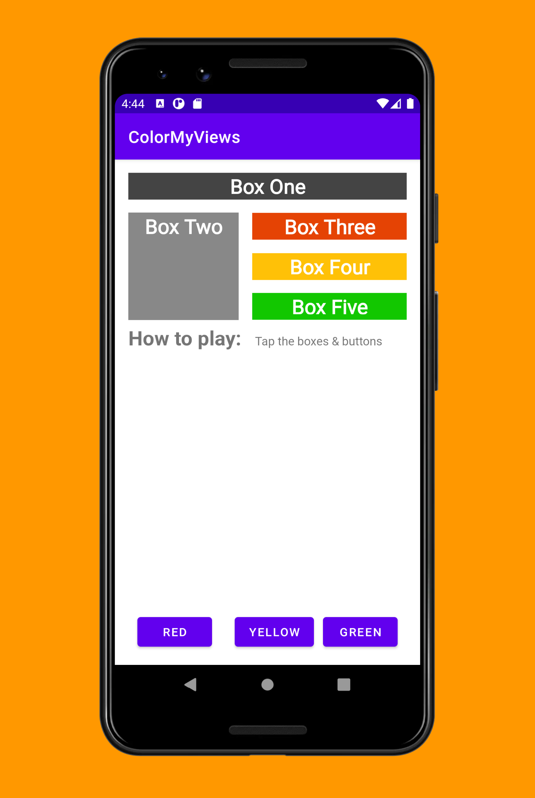

## AboutMe

The ColorMyViews app is inspired by the Dutch artist, Piet Mondrian. He invented a style of painting style called neoplasticism, which uses only vertical and horizontal lines and rectangular shapes in black, white, gray, and primary colors

Although paintings are static, your app will be interactive! The app consists of clickable text views that change color when tapped, and button views in a constraintLayout.

## Screenshots

